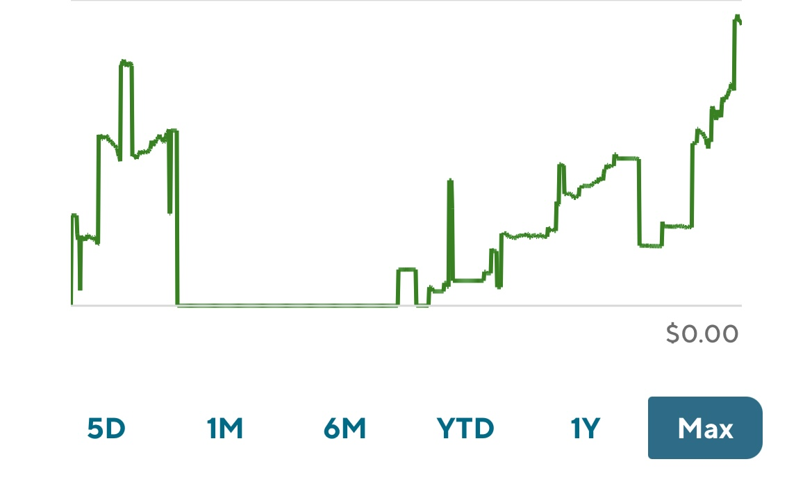

# holistic_portfolio_returns

Does your portfolio's returns look like this?

Even if you don't have frequent deposits or withdrawals like above, it can still be hard to calculate your portfolio's returns. For example, with Schwab, you can see the returns of all *current* holdings in the "Gain/Loss" tab, but that doesn't provide any insights into the overall returns of the portfolio, which may very well include holdings which have been sold off. You can see the portfolio's value over time with the portfolio value graph, but that is inclusive of deposits or withdrawals.

And let's not even crack open the can of worms that is multiple brokerage accounts. In short, you know it can be difficult to calculate the total performance across all of your portfolios. This project attempts to give you a holistic view of how your investment portfolios are doing by using the data from the monthly portfolio statements that you receive from your brokerages. Those PDF statements are parsed with a python script that grabs a couple of data points, including the deposit, withdrawal, and balance value for every given month. From those data points, we can calculate the portfolio's returns over time.

Input: PDFs of monthly brokerage statements \
Output: a .csv file containing the deposit, withdrawal, and balance value for every given month + a summary of portfolio returns

Portfolio return calculations are based on the same information in the .csv file described above (so monthly data on deposits, withdrawals, and the account value). As a result, returns are not precise, but are still reflective of a portfolio’s long-term trend. One interesting feature (that is still WIP) is you can benchmark the portfolio against a market index by simulating what the value of the portfolio would be if you bought or sold SPY or QQQ instead of your portfolio.

Currently, it supports: \
• Schwab \
• Robinhood (only account value and date, not withdrawals or contributions) \
• Brokers who use Apex Clearing (which includes Public.com, Firstrade, M1, Sofi, Webull, Ally, Bettermint, Axos, Wealthsimple, Tradier, TradingBlock, ViewTrade, LevelX, TradeZero, Gatsby, Farther Finance, etc.; for the full list, see https://investorjunkie.com/stock-brokers/broker-clearing-firms/)

Planning to support: \
• TDAmeritrade \
• Vanguard

The only file you need to interface with is `parse_statements.py`, where you need to add the path to the folder that contains your broker’s portfolio statements; note, the statements can have nay name, bb they need to have come from the same brokerage.

# Libraries used

PDF extraction via the pdf-to-text library \
(You probably don't have this and should consult this website for installation instructions: https://pypi.org/project/pdftotext/) \
`pip3 install pdftotext`

Financial Data pull (for Index-tracking ETFs):
https://github.com/ranaroussi/yfinance \ 
`pip3 install yfinance`